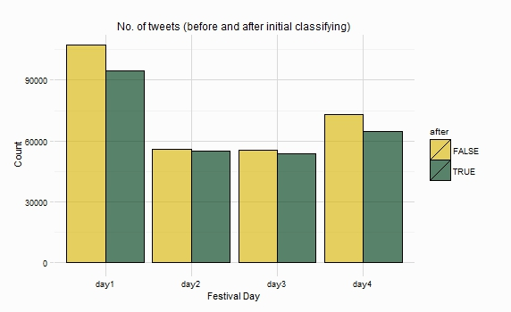

<a href="https://twitter.com/share" class="twitter-share-button" data-url="http://durtal.github.io/cheltenham-festival-2015-twitter/classifying.html" data-text="Cheltenham Festival 2015 Twitter Analysis, 'Classifying' tweets" data-via="UTVilla" data-related="_RcappeR" data-hashtags="rstats,CheltenhamFestival">Tweet</a>
<script>!function(d,s,id){var js,fjs=d.getElementsByTagName(s)[0],p=/^http:/.test(d.location)?'http':'https';if(!d.getElementById(id)){js=d.createElement(s);js.id=id;js.src=p+'://platform.twitter.com/widgets.js';fjs.parentNode.insertBefore(js,fjs);}}(document, 'script', 'twitter-wjs');</script>

```{r echo=FALSE}
# load data
load("data/day_one.RData")

# source functions
source("R/functions.R")

eg_tweets <- head(day_one_tweets$text)
eg_tweets <- tweet_cleaner(tweets = eg_tweets, concat_terms = "hurricane fly", rename_odds = TRUE, rm_punct = TRUE)
```

Once the tweets have been cleaned (see [here](cleaning.html)), we need to establish whether they "belong" to the festival.  During the process of cleaning, each tweet was parsed looking for runners at the festival, and these runners names were then concatenated, so "hurricane fly" becomes "hurricanefly", this allows the elimination of tweets that mention the two words "hurricane" and "fly" but not in the correct order that would indicate that the tweet was potentially about the Festival and the horse Hurricane Fly.

The [`findtweets`](https://github.com/durtal/cheltenham-festival-2015-twitter/blob/gh-pages/R/functions.R#L66-L83) function searches a tweet for any number of terms, returning a logical `TRUE` if a term appears, and a `FALSE` if no term appears.  As an example, we'll use the same 6 tweets seen in the cleaning section.

```{r echo=FALSE}
eg_tweets
```

Two of the horses that were 'tracked' were Hurricane Fly and Douvan, they both feature in the tweets above, below shows the use of `findtweets`:

```{r}
findtweets(tweets = eg_tweets, searchfor = c("Douvan", "Hurricane Fly"))
```
```{r echo=FALSE}
ind <- findtweets(tweets = eg_tweets, searchfor = c("Douvan", "Hurricane Fly"))
eg_tweets[ind]
```

Using the [terms](http://durtal.github.io/cheltenham-festival-2015-twitter/data/initial_search.txt) that were 'tracked' in the searchfor parameter produces a logical vector that can be used to subset tweets, isolating those that do not contain one of the phrases initially tracked.  So a tweet containing "hurricane fly" in that order is included in the subset, while a tweet containing "fly hurricane" will be removed.  The plot below shows the number of tweets collected on each day, and the number of tweets that remained after the step above was produced.  Roughly 25k tweets were removed over the four days.



The `findtweets` function can also count the number of horses/phrases that appear in each tweet, the more horses/phrases that appear in a tweet, the more confident we can be that the tweet is Festival related.  We can add a racing lexicon to the terms we 'tracked', this lexicon can be found [here](https://github.com/durtal/cheltenham-festival-2015-twitter/blob/gh-pages/data/racing_lexicon.txt), also added to the lexicon are the other runners at the Festival, resulting in a lexicon of about 700 horses, gambling and other racing terms.  The plot below shows the distribution of the number of terms in the lexicon mentioned in each tweet. 


So there are a few tweets with 15 terms in a tweet, these tweets we can be confident that they are Festival related, if you follow any racing fans then you can perhaps guess what one of these tweets looks like:

**"odds douvan bentilimarew odds undesceaux clarcam ew oddsthe druids nephew lostlegendew odds jezki odds anniepower nap pollypeachum ew cheltfest"**

Those tweets with just one term mentioned, around 30k tweets, we can be less confident about.